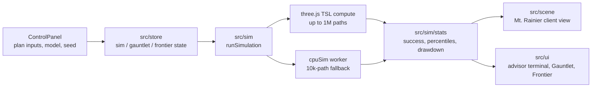

# GPU Monte Carlo Lab

[](https://cmathew654-dot.github.io/gpu-monte-carlo-lab/)
[](https://threejs.org/)
[](https://react.dev/)
[](LICENSE)

[](https://cmathew654-dot.github.io/gpu-monte-carlo-lab/)

*This walkthrough shows CPU mode. Open the [live demo](https://cmathew654-dot.github.io/gpu-monte-carlo-lab/) in a WebGPU browser for the 3D client view and 100× more scenarios.*

I built GPU Monte Carlo Lab to compare retirement plans across simulation assumptions. Clients get one plain-language result, while advisors can see how it changes across models and historical cohorts, including when a plan runs out of money and the size of the shortfall.

## The 60-second read

| Area | Result |
| --- | --- |
| Client and advisor views | Clients get a plain-language solvency result. The advisor view keeps distributions and drawdowns from the same calculation. |
| Primary models | Compare GBM, historical bootstrap, and Student-t with the same inputs and seed. |
| Regime-t | The Robustness Frontier tests persistent volatility as a separate assumption. |
| Spending capacity | The Frontier finds the highest tested monthly spend near 90% success for each model and reports the lowest result. |
| Historical cohorts | Replay six retirement dates from 1929 through 2008. |
| Failure severity | See when money runs out and how much real spending remains unfunded. |

### Fixed A6 validation fixture

These measured CPU results use: $1,000,000 initial
wealth, $5,000 monthly spending, 30 years, an 80%→60% equity glidepath, 10,000
paths, and seed 42.

| Lens | Current success | P50 terminal wealth | Tested 90% capacity |
| --- | ---: | ---: | ---: |
| GBM | 51.49% | $35,653.86 | $3,632.8125/mo |
| Historical bootstrap | 60.31% | $354,621.58 | $3,476.5625/mo |
| Student-t(5) | 51.58% | $38,734.97 | $3,632.8125/mo |
| Regime-t, latest-filtered | 64.91% | $413,119.59 | $3,984.3750/mo |

All four searches converged on evaluated curve points. Direct reruns reproduced
the same success counts, and the measured curves had zero upward reversal. The
current-plan success range is **51.49%–64.91%**; the robust spending floor is
**$3,476.5625/month**, set by the historical bootstrap.

Regime-t produces the highest result in this fixture. Persistence tests a different assumption from stress.

## What the product lets an advisor ask

1. **Does this plan work?** The selected primary model drives the client
   sentence, mountain, terminal-wealth distribution, drawdown, and failure
   statistics.
2. **Does the answer survive different assumptions?** Triangulation runs all
   three primary models on identical financial inputs, seed, and path count.
3. **How much spending survives every lens?** An explicit Frontier action
   evaluates GBM → bootstrap → Student-t → Regime-t. It shows each 90% capacity,
   the evaluated spending curve, and the minimum robust floor.
4. **What happened to real retirees?** The Historical Gauntlet replays six named
   retirement months against the exact observed equity and bond sequence,
   including ending wealth and the maximum supported withdrawal rate.
5. **If it fails, how bad is it?** Median failure year is paired with median
   shortfall years and median unfunded real withdrawals.

## What you're looking at

**Client view.** Mt. Rainier is rendered from USGS elevation data (NED / SRTM
via Mapzen Terrarium). Simulated futures climb the mountain as wealth paths.
Futures that exhaust the portfolio ignite as embers and slide downhill; a gold
thread marks the median outcome. The language stays client-readable:
*“In 70 of 100 futures, your money outlives you.”*

**Advisor view.** The field terminal exposes success probability, terminal
wealth percentiles, worst-decile drawdown, 90% spending capacity, median
failure year, and failure magnitude. Separate Futures, Gauntlet, and Frontier
lenses keep model sensitivity, historical evidence, and capacity search from
collapsing into one overloaded score.

The primary simulation supports up to 1,000,000 paths on WebGPU. Non-WebGPU
browsers use the 10,000-path CPU fallback. Frontier candidates run sequentially
at 100,000 paths on GPU or 10,000 paths on CPU so results publish as one
complete, internally consistent set.

## Architecture



## Models: three primary, one frontier-only

| Model | Selectable primary model | Triangulation | Robustness Frontier | Question it asks |
| --- | :---: | :---: | :---: | --- |
| Historical bootstrap | Yes | Yes | Yes | What if whole years from observed US history recur? |
| GBM | Yes | Yes | Yes | What does the classic lognormal baseline imply? |
| Student-t(5) | Yes | Yes | Yes | What changes when extreme monthly returns are more common? |
| Regime-t | No | No | Yes | What changes when joint volatility persists in latent regimes? |

The first three remain the product's selectable return-model family. Regime-t
has a narrower role: a two-state bivariate Student-t scale HMM calibrated
offline to paired equity and bond returns. The states share a conditional mean
and correlation structure; only covariance scale persists and switches.
Regime-t therefore does **not** model changing stock–bond correlation,
state-dependent expected returns, or named bull/bear regimes. Its
latest-filtered initialization is conditional on data through 2026-06, not a
market call.

## Data and methodology

The simulation draws every future from Robert Shiller's public *Irrational
Exuberance* dataset or from a model calibrated against it. The shipped series contains **1,206
monthly real total returns from 1926-01 through 2026-06** for equities and
10-year Treasuries. It spans the Depression, stagflation, the dot-com bust, and
the Global Financial Crisis.

The data build is reproducible:

```bash
python3 src/data/build_historical.py
node src/data/validate_data.mjs
```

The pipeline re-derives Shiller's Real Total Return column to a maximum
difference of 5.6e-16. [docs/calibration.md](docs/calibration.md) defends each
assumption against the source data and documents the Regime-t fit, acceptance
criteria, and limitations.

## Validation

Run the validation commands:

```bash
npm run test:sim
npm run test:stats
npm run test:triangulation
npm run test:gauntlet
npm run test:regime
npm run test:frontier
npm run test:frontier-validate
npm run test:validate
npm run test:compute-probe
```

- Same seed and parameters produce byte-identical results; the 10,000-path run
  is an exact subset of the 100,000-path run.
- `test:validate` passes its 56-check falsification matrix, including
  analytic GBM moments, path-count independence, bootstrap calibration,
  scenario presets, and 90% withdrawal searches.
- `test:frontier-validate` runs the production four-model CPU frontier twice
  from fresh copied buffers, requires exact deterministic equality, reruns each
  converged capacity directly, and then executes Regime-t calibration and
  initialization-sensitivity acceptance. The test reports elapsed time separately from deterministic evidence and does not present it as a product-performance claim.
- Tint compiles the production WebGPU shader graphs, and the repository keeps
  reviewable WGSL snapshots. A CPU reference engine provides an independent
  numerical path.

Physical-GPU regime/frontier timing remains unmeasured. The software-rendered CI
environment can compile the production graphs and exercise CPU fallback, but it
cannot support an honest real-device performance claim.

## Limitations

- **US exceptionalism.** The historical evidence is a single unusually
  successful national market. It cannot manufacture a Japan-1989 experience
  absent from the source data.
- **Model range is not a confidence interval.** The four lenses carry no model
  weights or probabilities. The robust floor is a tested simulation threshold,
  not individualized advice or a guarantee.
- **Persistence scope.** Twelve-month bootstrap blocks cannot
  force a multi-year Depression sequence. Regime-t adds persistent volatility
  scale, but not changing expected returns or stock–bond correlation.
- **Latest-filtered can be optimistic.** In the fixed fixture Regime-t produced
  the highest current success and capacity. Stationary initialization is kept
  as a sensitivity check; the application publishes latest-filtered
  results.
- **Real-dollar reporting.** Failure means the portfolio exhausts its real purchasing
- power. The tool reports the remaining obligation in real, undiscounted dollars.
- Translating that into a nominal client plan remains the advisor's job.
- **Physical-GPU performance is unmeasured.** The repository defines real-device timing and parity protocols and makes no physical-GPU timing claim.

## Status and roadmap

The analysis layers previously listed as roadmap items now ship in the product:
multi-stat model triangulation, the six-cohort Historical Gauntlet,
magnitude-of-failure presentation, the Robustness Frontier, and its
frontier-only Regime-t lens.

The remaining work is to publish the demo evidence and run the physical-GPU protocol. Geographic claims still require data beyond the United States.

## Development and verification

I used [docs/CONTRACTS.md](docs/CONTRACTS.md) to keep the simulation, data pipeline, statistics, visualization, and UI work on shared interfaces, while [validation/REPORT.md](validation/REPORT.md) records the release checks and evidence gaps. A reproducible command supports each quantitative claim in this README; the README labels anything else unmeasured.

## Tech stack

TypeScript · React · three.js WebGPU (TSL compute) · Zustand · Vite · CPU
fallback engine.

## Run it

```bash
npm install
npm run dev
```

Open in a WebGPU-capable browser (Chrome/Edge or Safari 26+) for the full 3D
view. Other browsers use the CPU fallback engine. Use
`npm run build` for a production bundle and the commands above for focused
verification.

## Repo map

- [DEMO.md](DEMO.md): scripted client conversations backed by engine output.
- [docs/calibration.md](docs/calibration.md): source data, primary-model
  assumptions, Regime-t calibration, and limitations.
- [docs/AMENDMENT_A6.md](docs/AMENDMENT_A6.md): the four-model Frontier and
  Regime-t runtime/acceptance contract.
- [validation/REPORT.md](validation/REPORT.md): independent QA findings and
  ship gate.
- `src/sim/frontier/`: four-model capacity search and CPU/GPU adapters;
  `src/sim/regime/`: calibration artifact, HMM, runtime, and acceptance gates;
  `src/sim/gauntlet/`: deterministic historical-cohort replay.
- `src/sim/`: primary GPU/CPU simulation and statistics; `src/data/`: Shiller
  pipeline and scenario presets; `src/validation/`: fixed-fixture validators.
- `src/scene/`: Mt. Rainier client visualization and GPU work coordination;
  `src/ui/`: client/advisor surfaces; `src/store/`: simulation, gauntlet, and
  frontier state.
- `probe/`: headless-Chromium harness for production shader compilation and
  reviewable WGSL snapshots.

## License

[MIT](LICENSE) © 2026 GPU Monte Carlo Lab contributors.
